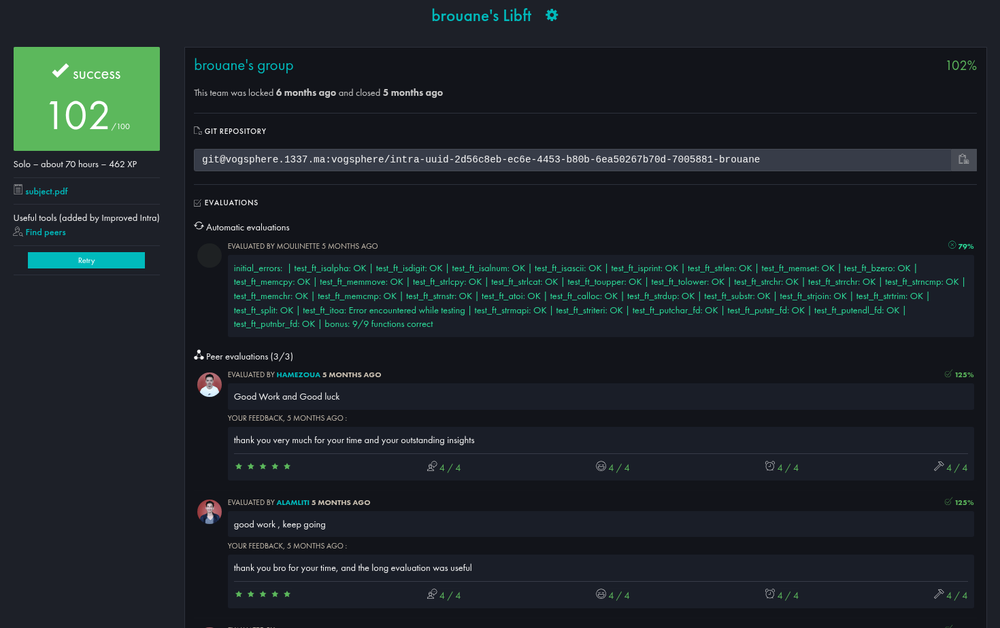

<div align="center">

```
██╗     ██╗██████╗ ███████╗████████╗
██║     ██║██╔══██╗██╔════╝╚══██╔══╝
██║     ██║██████╔╝█████╗     ██║   
██║     ██║██╔══██╗██╔══╝     ██║   
███████╗██║██████╔╝██║        ██║   
╚══════╝╚═╝╚═════╝ ╚═╝        ╚═╝   
```

*A 42 curriculum project — build your own C standard library from scratch.*


</div>

---

## ✅ Project grade screenshot



## 📖 What is libft?

**libft** is the very first project in the 42 curriculum. The premise is simple but foundational:

- You are **forbidden** from using most standard C library functions
- You must re-implement them yourself — from memory management to string manipulation
- The result is a personal `.a` static library that you will **reuse in every future 42 project**

This project builds deep understanding of how the C standard library works under the hood: pointer arithmetic, memory layout, null-termination, edge cases, and undefined behavior. Everything you write here, you'll rely on later.

---

## 🚀 Getting Started

### Compilation

```bash
make          # build libft.a
make bonus    # build with linked list functions
make clean    # remove object files
make fclean   # full cleanup
make re       # recompile from scratch
```

### Linking to Your Project

```bash
gcc main.c -L. -lft -o my_program
```

Or with the header:

```c
#include "libft.h"
```

---

## 📦 Function Reference

The library is split into four categories:

```
libft
├── 🔤  Character checks & conversions   (is*, to*)
├── 🧠  Memory functions                  (mem*)
├── 📝  String functions                  (str*, ft_split, ft_itoa, ft_atoi)
├── 🖨️  File descriptor output            (put*_fd)
└── 🔗  Linked list manipulation (bonus)  (lst*)
```

---

### 🔤 Character Functions

| Function | Description |
|----------|-------------|
| `ft_isalpha(c)` | Returns nonzero if `c` is an alphabetic character |
| `ft_isdigit(c)` | Returns nonzero if `c` is a decimal digit |
| `ft_isalnum(c)` | Returns nonzero if `c` is alphanumeric |
| `ft_isascii(c)` | Returns nonzero if `c` is a valid ASCII character (0–127) |
| `ft_isprint(c)` | Returns nonzero if `c` is a printable character |
| `ft_toupper(c)` | Converts a lowercase letter to uppercase |
| `ft_tolower(c)` | Converts an uppercase letter to lowercase |

---

### 🧠 Memory Functions

| Function | Description |
|----------|-------------|
| `ft_memset(s, c, n)` | Fills `n` bytes of memory at `s` with byte `c` |
| `ft_bzero(s, n)` | Zeroes out `n` bytes at `s` (calls `ft_memset`) |
| `ft_memcpy(dst, src, n)` | Copies `n` bytes from `src` to `dst` (no overlap) |
| `ft_memmove(dst, src, n)` | Like `memcpy` but handles overlapping memory regions |
| `ft_memchr(s, c, n)` | Scans `n` bytes of `s` for byte `c`, returns pointer or NULL |
| `ft_memcmp(s1, s2, n)` | Compares `n` bytes between `s1` and `s2` |
| `ft_calloc(n, size)` | Allocates `n * size` zeroed bytes; handles edge cases |

---

### 📝 String Functions

| Function | Description |
|----------|-------------|
| `ft_strlen(s)` | Returns the length of string `s` |
| `ft_strlcpy(dst, src, size)` | Copies `src` into `dst` with size bound; returns `strlen(src)` |
| `ft_strlcat(dst, src, size)` | Appends `src` to `dst` with size bound; returns combined length |
| `ft_strchr(s, c)` | Returns pointer to first occurrence of `c` in `s` |
| `ft_strrchr(s, c)` | Returns pointer to last occurrence of `c` in `s` |
| `ft_strncmp(s1, s2, n)` | Compares up to `n` characters of `s1` and `s2` |
| `ft_strnstr(big, little, len)` | Finds `little` in `big` within `len` characters |
| `ft_strdup(s)` | Allocates and returns a duplicate of string `s` |
| `ft_substr(s, start, len)` | Extracts a substring of `s` starting at `start` |
| `ft_strjoin(s1, s2)` | Allocates and returns the concatenation of `s1` and `s2` |
| `ft_strtrim(s1, set)` | Trims characters in `set` from both ends of `s1` |
| `ft_split(s, c)` | Splits `s` by delimiter `c` into a null-terminated array |
| `ft_atoi(s)` | Converts string `s` to integer |
| `ft_itoa(n)` | Converts integer `n` to a newly allocated string |
| `ft_strmapi(s, f)` | Applies function `f` to each char of `s`, returns new string |
| `ft_striteri(s, f)` | Applies function `f(index, &char)` in-place on `s` |

---

### 🖨️ Output Functions

| Function | Description |
|----------|-------------|
| `ft_putchar_fd(c, fd)` | Writes character `c` to file descriptor `fd` |
| `ft_putstr_fd(s, fd)` | Writes string `s` to file descriptor `fd` |
| `ft_putendl_fd(s, fd)` | Writes string `s` followed by `\n` to `fd` |
| `ft_putnbr_fd(n, fd)` | Writes integer `n` as a string to `fd` |

---

### 🔗 Linked List Functions (Bonus)

The bonus part introduces a singly linked list type:

```c
typedef struct s_list
{
    void          *content;
    struct s_list *next;
} t_list;
```

| Function | Description |
|----------|-------------|
| `ft_lstnew(content)` | Creates and returns a new list node |
| `ft_lstadd_front(lst, new)` | Prepends `new` node to the front of `lst` |
| `ft_lstadd_back(lst, new)` | Appends `new` node to the back of `lst` |
| `ft_lstsize(lst)` | Returns the number of nodes in the list |
| `ft_lstlast(lst)` | Returns the last node of the list |
| `ft_lstdelone(lst, del)` | Frees a single node using `del` on its content |
| `ft_lstclear(lst, del)` | Frees the entire list using `del` on each content |
| `ft_lstiter(lst, f)` | Applies function `f` to the content of every node |
| `ft_lstmap(lst, f, del)` | Creates a new list by applying `f` to each node's content |

---

## 📁 Project Structure

```
libft/
│
├── Makefile               # Build rules for libft.a and bonus
├── libft.h                # All typedefs, structs, and function prototypes
│
├── ft_isalpha.c           # Alphabetic character check
├── ft_isdigit.c           # Digit character check
├── ft_isalnum.c           # Alphanumeric check
├── ft_isascii.c           # ASCII range check
├── ft_isprint.c           # Printable character check
├── ft_toupper.c           # Lowercase to uppercase
├── ft_tolower.c           # Uppercase to lowercase
│
├── ft_memset.c            # Fill memory with a byte
├── ft_bzero.c             # Zero-fill memory
├── ft_memcpy.c            # Copy memory region
├── ft_memmove.c           # Copy with overlap handling
├── ft_memchr.c            # Scan memory for byte
├── ft_memcmp.c            # Compare memory blocks
├── ft_calloc.c            # Allocate and zero memory
│
├── ft_strlen.c            # String length
├── ft_strlcpy.c           # Bounded string copy
├── ft_strlcat.c           # Bounded string concatenation
├── ft_strchr.c            # First char occurrence in string
├── ft_strrchr.c           # Last char occurrence in string
├── ft_strncmp.c           # Bounded string comparison
├── ft_strnstr.c           # Bounded substring search
├── ft_strdup.c            # Duplicate a string
├── ft_substr.c            # Extract substring
├── ft_strjoin.c           # Concatenate two strings
├── ft_strtrim.c           # Trim chars from both ends
├── ft_split.c             # Split string by delimiter
├── ft_atoi.c              # String to integer
├── ft_itoa.c              # Integer to string
├── ft_strmapi.c           # Map function over string (new string)
├── ft_striteri.c          # Map function over string (in-place)
│
├── ft_putchar_fd.c        # Write char to fd
├── ft_putstr_fd.c         # Write string to fd
├── ft_putendl_fd.c        # Write string + newline to fd
├── ft_putnbr_fd.c         # Write integer to fd
│
├── ft_lstnew_bonus.c      # Create new list node
├── ft_lstadd_front_bonus.c # Prepend to list
├── ft_lstadd_back_bonus.c  # Append to list
├── ft_lstsize_bonus.c     # Count list nodes
├── ft_lstlast_bonus.c     # Get last node
├── ft_lstdelone_bonus.c   # Delete one node
├── ft_lstclear_bonus.c    # Delete entire list
├── ft_lstiter_bonus.c     # Iterate over list
└── ft_lstmap_bonus.c      # Map function over list
```

---

## 🔄 Key Implementation Details

### `ft_split` — String Splitting

```
Input: "  hello  world  foo  "   delimiter: ' '
         ────────────────────────────────────────
Phase 1: count_words()  →  3
Phase 2: allocate char** of size 4 (3 words + NULL)
Phase 3: for each word → malloc + copy chars
Result:  ["hello", "world", "foo", NULL]
```

### `ft_itoa` — Integer to String

```
n = -2048
─────────────────────────────────
numlen(-2048) = 5   ('-', '2', '0', '4', '8')
malloc(6)
Fill from right: '8', '4', '0', '2'
Fill index 0:    '-'
Result: "-2048\0"
```

### `ft_memmove` — Safe Overlap Handling

```
If dst > src → copy backwards (avoids overwrite)
If dst < src → copy forwards  (safe direction)

Example overlap:
src:  [A][B][C][D][E]
           ↑
dst:       [A][B][C][D][E]   ← dst > src, copy backwards
```

### `ft_lstmap` — Functional Mapping

```
lst:      [node1] → [node2] → [node3] → NULL
                ↓ f applied to each content
new_lst:  [f(c1)] → [f(c2)] → [f(c3)] → NULL

On malloc failure → ft_lstclear(&new, del) and return NULL
```

---

## 🛠️ Error Handling

Key behaviors across the library:

- All allocation functions return `NULL` on `malloc` failure
- `ft_calloc(0, 0)` returns a valid 1-byte allocation (per standard behavior)
- `ft_substr` with `start > strlen(s)` returns an empty allocated string
- `ft_strtrim`, `ft_strjoin`, `ft_split` all return `NULL` if input is `NULL`
- `ft_lstmap` clears the partial new list if any node allocation fails

---

## 📊 Mandatory vs Bonus

| Part | Functions | Description |
|------|-----------|-------------|
| Part 1 | `isalpha` → `calloc` | Reimplementations of standard libc functions |
| Part 2 | `substr` → `striteri` | Additional string utilities not in standard libc |
| Bonus | `lstnew` → `lstmap` | Linked list manipulation with function pointers |

---

## 🔗 Resources

| Resource | Link |
|----------|------|
| 42 Cursus Guide | [libft chapter](https://42-cursus.gitbook.io/guide/2-rank-00/libft) |
| Man pages reference | [man7.org](https://man7.org/linux/man-pages/) |
| libft tester | [Tripouille/libfTester](https://github.com/Tripouille/libfTester) |
| Memory & pointers | [YouTube](https://www.youtube.com/watch?v=zuegQmMdy8M) |

---

## 📝 Notes on AI Usage

AI tools were used during development for:
- Debugging edge cases and undefined behavior
- Understanding differences between `memcpy` and `memmove`
- Improving documentation clarity

All implementations were fully written, understood, and owned by the author.

---

<div align="center">

*Made with stubbornness and segfaults as part of the 42 curriculum.*

</div>
